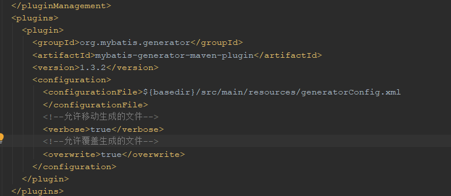
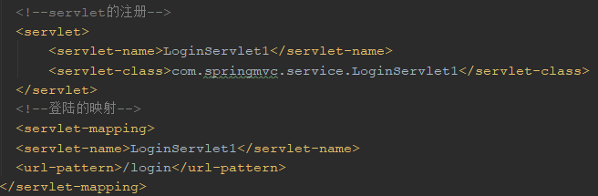

# 基于SSM框架建立简单的聊天室
## 记录搭建SSM框架  
首先主要参考的链接为：[https://www.cnblogs.com/toutou/p/ssm_spring.html],特此感谢头头哥！  
  
### 这里说一下自己的问题：
- 首先是数据库的配置问题，本人数据库版本为8.0.16，所以需要修改pom.xml中的jdbc的版本，特别地Mysql8以上的driver是com.mysql.cj.jdbc.Driver
注意有个cj,（数据库有个时区的问题，在url加入serverTimezone=GMT%2B8）
- 然后是左侧的Maven没有mydatis-generator:generate，在这里进行的操作是将   
 由图片可知，注意层级管旭，将数据库的配置放在与与pluginManagement同级的目录下  
- 运行会出现404错误，这是因为参考文章中web.xml首页的配置路径为/WEB-INF/index.jsp，这里需要修改为/index.jsp，特此感谢讨论区给出的修改意见！  
--------------
### 练习servlet时碰到的问题
- 要将servlet与http中的方法在web.xml中建立映射  
暂未解决的问题：
如何将编译好的文件.class放到WEB-INF中的classes中，使Tomcat找到对于的servlet，不然会出现500错误
  
  解决方法在这里需要在web.xml进行servlet的注册，以及需要配置表单action和servlet的映射  
     
  注意servlet-class需要填写包名，全程，在这里有个简单的操作是直接右键新建servlet，IDEA会自动在web.xml进行相关配置
